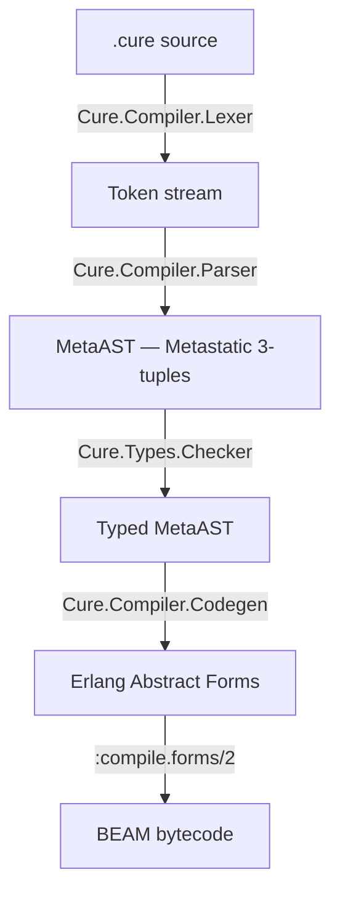

# Cure

Dependently-typed programming language for the BEAM virtual machine with
first-class finite state machines and SMT-backed verification.

Cure compiles `.cure` source files to BEAM bytecode, enabling programs to run
natively on the Erlang VM alongside Erlang and Elixir code.

## Status

All core milestones complete. The full compilation pipeline is operational:
lexer, parser, bidirectional type checker with record types, refinement types
and exhaustiveness analysis, protocol dispatch codegen, BEAM code generation,
FSM compilation with structural verification, effect system, documentation
generator, formatter, stdlib, CLI, CI, and example programs.

v0.29.0 themes itself "Make Documentation Great" and is the
documentation release. `cure doc` now produces an ExDoc-like
two-pane site driven by a new `[doc]` section in `Cure.toml`
(`main`, `title`, `extras`, `[doc.groups_for_modules]`); module docs
render as Markdown (via the NIF-free `:md` library) with
Makeup-powered syntax highlighting for `cure` / `elixir` / `erlang`
fenced code. Every module under `lib/std/` carries a module-level
`## Examples` block, four high-traffic `Std.Core` functions carry
per-function examples, and the Cure website ships `/stdlib` and
`/stdlib/:module` pages (`CureSite.Stdlib` bundles the same `.cure`
sources at site compile time). The REPL's `:help` / `:doc` output
graduates to a block-aware Markdown-to-ANSI renderer, the parser
merges consecutive `##` doc-comment blocks across blank-line gaps, a
standalone highlight.js language description ships under
`highlightjs-cure/`, and both the Vim (`vicure/`) and VS Code
(`vscode-cure/`) plugins are re-aligned with the current grammar.
See [`docs/DOC.md`](docs/DOC.md) for the `cure doc` reference and
[`docs/TUTORIAL.md`](docs/TUTORIAL.md) Chapter 13 for a walkthrough.

v0.28.0 shipped "Talk Back" -- parser error recovery
(`E063`), "did you mean?" suggestions everywhere,
`cure fmt --dry-run`, `cure bless` (Socratic type-error assistant),
`@record` + `cure replay` (FSM time-travel), a Playground with
live type-checking and a sandboxed evaluator, and a type-checker
bug fix for ill-typed polymorphic lambdas. v0.28.1 and v0.28.2
followed with REPL top-level declarations (`Cure.REPL.Session`)
and session-signature installation into the type-checker env.

v0.27.0 themes itself "See Your System Breathe" and adds the
observability and verification surface around v0.26.0's OTP
applications. It ships `Cure.OTel` (OpenTelemetry-compatible span
bridge), `cure top` (snapshot-based runtime observer), `cure trace`
(typed :dbg wrapper), `Cure.Temporal` (LTL-style bounded model
checker over FSMs), `Cure.Protocol` (session-typed binary protocols
between actors), `Cure.Types.Synth` (typed-hole suggestions via
`cure synth`), three new stdlib modules (`Std.Time`, `Std.Regex`,
`Std.CRDT`), and OSC 8 clickable-filepath error messages via
`Cure.Term.Hyperlink`. A LiveView Playground lands on
[cure-lang.org/playground](https://cure-lang.org/playground) and
`examples/cure_atelier/` exercises every new surface end to end. See
[`docs/OBSERVABILITY.md`](docs/OBSERVABILITY.md),
[`docs/TEMPORAL.md`](docs/TEMPORAL.md),
[`docs/PROTOCOL.md`](docs/PROTOCOL.md), and
[`docs/PLAYGROUND.md`](docs/PLAYGROUND.md) for the on-disk references.

v0.26.0 promoted the supervision surface into a full OTP application
lifecycle. A new `app` container declares the project's OTP application
in Cure source; it compiles to a loaded `Application` callback module,
emits an `<name>.app` OTP resource file, and is buildable as a
self-contained BEAM release with `cure release` (or `mix cure.release`).
The release introduces `[application]` and `[release]` sections in
`Cure.toml`, adds `Std.App` to the stdlib (a thin wrapper around
`:application`), catalogues five new error codes (`E051`-`E055`), and
ships `examples/cure_forge/` as the canonical end-to-end showcase.
See [`docs/APP.md`](docs/APP.md) for the on-disk reference and
[cure-lang.org/applications](https://cure-lang.org/applications) for
the web version.

v0.25.0 lands typed supervision trees on top of OTP. The release
introduces the Melquiades Operator `<-|` (unicode alias `✉`) for typed
sends, an `actor` container that compiles to a loaded `GenServer`
module, a `sup` container that compiles to a verified `Supervisor`
behaviour module, and a new stdlib surface (`Std.Actor`,
`Std.Process`, `Std.Supervisor`) that exposes the runtime from Cure
source. See [`docs/SUPERVISION.md`](docs/SUPERVISION.md) for the
on-disk reference and [cure-lang.org/actors](https://cure-lang.org/actors)
for the web version.

v0.24.0 rewrites the interactive REPL on top of a raw-mode line editor
with live `Makeup`-powered syntax highlighting, persistent history,
`Ctrl+R` incremental reverse search, Tab completion, a minimal vi mode,
and a `Marcli`-rendered `:help`. See
[`docs/REPL.md`](docs/REPL.md) for the on-disk reference and
[cure-lang.org/repl](https://cure-lang.org/repl) for the web version.

## Architecture



Every pipeline stage emits structured events via `Cure.Pipeline.Events`,
backed by an Elixir `Registry` in PubSub mode. External tools (LSP, profilers,
IDE plugins) can subscribe to observe and react to compilation in real time.

## Internal Representation

Cure uses [Metastatic](https://hexdocs.pm/metastatic)'s MetaAST 3-tuple
format as its internal AST:

```elixir
{type_atom, keyword_meta, children_or_value}
```

This provides a well-defined, layered AST structure and interoperability with
Metastatic's cross-language analysis tools.

## Key Features

- **Dependent types** -- types that depend on values, verified at compile time
- **Refinement types** -- constrained subtypes checked via SMT solver
- **Records** -- named product types with construction (`Point{x: 1, y: 2}`),
  field access (`p.x`), and functional update (`Point{p | x: new_x}`);
  compile to BEAM maps; type-checked with per-field schemas
- **First-class FSMs** -- finite state machines as language constructs with
  compile-time verification (reachability, deadlock freedom, hard event validation),
  dual-mode compilation (simple `gen_statem` or callback `GenServer`),
  Finitomata-inspired `!`/`?` event suffixes, inline `on_transition` handlers,
  and lifecycle callbacks (`on_enter`, `on_exit`, `on_failure`, `on_timer`)
- **Typed actors and supervisors** (v0.25.0) -- `actor Name` containers
  compile to loaded `GenServer` modules; `sup Name` containers compile
  to verified `Supervisor` behaviour modules with compile-time checks on
  strategy / intensity / period / child-id uniqueness / restart /
  shutdown. `Std.Actor`, `Std.Process`, and `Std.Supervisor` expose the
  runtime from Cure source
- **Applications and releases** (v0.26.0) -- an `app Name` container
  declares the project's OTP `Application` callback in Cure source with
  `vsn`, `description`, `root`, `applications`, `env`, `on_start`,
  `on_stop`, and `on_phase :name` clauses. The compiler rejects
  projects with more than one `app` container and cross-checks its
  name and start phases against `[application]` in `Cure.toml`. The
  `cure release` subcommand (also `mix cure.release`) packages the
  compiler output as a bootable BEAM release under
  `_build/cure/rel/<name>/`. `Std.App` exposes `ensure_all_started`,
  `start`, `stop`, `get_env`, `put_env`, `which_applications`,
  `loaded_applications`, and `start_phase` from Cure source
- **Melquiades Operator** (v0.25.0) -- `pid <-| message` (unicode alias
  `pid ✉ message`) is a typed send operator that lowers to Erlang's
  `!`; the type checker unifies the message type against the receiver's
  inbox ADT
- **Indentation-structured** -- no closing delimiters, visual layout determines scope
- **Expression-oriented** -- everything is an expression, the last expression in a block is its value
- **BEAM-native** -- compiles to standard BEAM bytecode, full OTP interoperability
- **Protocols** -- ad-hoc polymorphism via `proto`/`impl` with
  guard-based dispatch compiled to multi-clause BEAM functions
- **Effect system** -- `! Io, Exception, ...` annotations; inferred when omitted

## Quick Example

```cure
mod MyApp.Math
  use Std.{Result, Option}

  type Sign = Positive | Negative | Zero

  fn factorial(n: Nat) -> Nat
    | 0 -> 1
    | n -> n * factorial(n - 1)

  fn classify(x: Int) -> Sign
    | x when x > 0 -> Positive
    | x when x < 0 -> Negative
    | _             -> Zero

  fn safe_divide(a: Int, b: {x: Int | x != 0}) -> Int = a / b
```

## Usage

```bash
# Compile a Cure source file to BEAM bytecode
mix cure.compile path/to/file.cure

# Compile all .cure files in a directory
mix cure.compile path/to/dir/ --output-dir _build/cure/ebin
```

## Interactive REPL (v0.24.0)

`cure repl` drops you into a readline-grade loop backed by a raw-mode
line editor with live Cure syntax highlighting (via `makeup_cure` +
`marcli`), persistent history, incremental reverse search, Tab
completion, and a minimal vi mode:

```text
cure(1)> fn add(a: Int, b: Int) -> Int = a + b
=> #Function<...>
cure(2)> :t add(1, 2)
add(1, 2) : Int
cure(3)> :bench add(1, 2) 10000
n=10000  min=1 us  avg=2 us  p95=3 us  max=42 us
```

Key bindings (emacs mode): `Left`/`Right` cursor, `Up`/`Down` for
history, `Ctrl+A`/`Ctrl+E` begin/end of line, `Ctrl+W` kill word,
`Ctrl+K`/`Ctrl+U` kill to end/start, `Ctrl+R` incremental history
search, `Tab` completion for meta-commands, file paths, loaded
modules and Cure keywords, `Ctrl+L` clear screen, `Ctrl+C` abort
line, `Ctrl+D` EOF. A minimal vi mode is available via `:mode vi`.
Meta-commands include `:t`, `:effects`, `:load`, `:reload`, `:use`,
`:fmt`, `:holes`, `:env`, `:reset`, `:history`, `:search`, `:save`,
`:edit`, `:time`, `:bench`, `:ast`, `:theme`, `:mode`, `:color`,
`:clear`, `:help`, `:quit`. See [`docs/REPL.md`](docs/REPL.md).

From Elixir code:

```elixir
# Compile and load into the running VM
{:ok, module} = Cure.Compiler.compile_and_load(source)
module.my_function(args)

# Compile with type checking enabled
{:ok, module} = Cure.Compiler.compile_and_load(source, check_types: true)

# Compile to disk
{:ok, module, warnings} = Cure.Compiler.compile_file("hello.cure")
```

## Modules

- `Cure` -- root module, version
- `Cure.Pipeline.Events` -- PubSub event system (Registry-backed); every
  pipeline stage emits structured events that external tools can subscribe to
- `Cure.Compiler` -- orchestrator: source -> lex -> parse -> [check] -> codegen -> .beam
- `Cure.Compiler.Token` -- token struct (`type`, `value`, `line`, `col`)
- `Cure.Compiler.Lexer` -- tokenizer for the full Cure syntax (keywords,
  operators, literals, indentation, string interpolation, FSM transitions)
- `Cure.Compiler.Parser` -- Pratt (precedence-climbing) parser producing
  MetaAST 3-tuples; indentation-aware, handles all expression and structural
  forms (functions, modules, records, types, protocols, implementations,
  imports, FSMs)
- `Cure.Compiler.Parser.Precedence` -- operator binding power table
- `Cure.Compiler.Codegen` -- MetaAST to Erlang abstract forms; compiles
  expressions, patterns, module assembly, `@extern` FFI wrappers, multi-clause
  functions, ADT constructors (tagged tuples), records (maps)
- `Cure.Compiler.BeamWriter` -- compiles Erlang abstract forms to BEAM
  bytecode via `:compile.forms/2` and writes `.beam` files
- `Cure.Types.Type` -- canonical type representations (primitives, composites,
  ADTs, `{:named, Name}` record references, function types, effects);
  subtyping, join, type-expression resolution
- `Cure.Types.Env` -- scoped typing environment with variable bindings and
  named type definitions (`Env.extend_type/3`, `Env.lookup_type/2`)
- `Cure.Types.Checker` -- bidirectional type checker; validates literals,
  variables, operators, function definitions, calls, let bindings, conditionals,
  pattern matching, blocks, collections, lambdas, records (construction,
  field access, update), modules (two-pass with record schema registration);
  emits `:type_checker` pipeline events
- `Cure.FSM.Verifier` -- structural FSM verification: reachability (BFS),
  deadlock freedom, terminal state validation, hard event validation,
  ambiguous transition warnings; emits `:fsm_verifier` events
- `Cure.FSM.Compiler` -- dual-mode FSM compiler: simple mode generates
  `gen_statem` BEAM modules; callback mode (with `on_transition` block)
  generates `GenServer`-based modules with embedded transition tables.
  Supports `!` (hard/auto-fire) and `?` (soft/silent) event suffixes,
  lifecycle callbacks (`on_enter`, `on_exit`, `on_failure`, `on_timer`),
  and introspection (`transitions/0`, `allowed?/2`, `responds?/2`)
- `Cure.Actor.Compiler` -- compiles `actor` containers into loaded
  `GenServer` modules via `Code.compile_string/2`; returns
  `{:ok, {:actor, module()}}`
- `Cure.Actor.Runtime` -- ETS-backed actor registry supervised by
  `Cure.Supervisor`; spawn / stop / lookup / list / monitor-driven
  cleanup. `Cure.Actor.State` is the shared runtime struct carrying
  `caller` / `meta` / `payload`
- `Cure.Sup.Verifier` -- structural supervisor verification (strategy,
  intensity, period, child-id uniqueness, restart / shutdown, self-
  reference cycles); emits `:sup_verifier` events
- `Cure.Sup.Compiler` -- compiles `sup` containers into loaded
  `Supervisor`-behaviour modules; returns `{:ok, {:supervisor, module()}}`
- `Cure.Sup.Runtime` -- lazy ETS-backed registry for running supervisor
  trees (`start/1,2`, `stop/1`, `lookup/1`, `which_children/1`, `list/0`)
- `Cure.Process.Builtins` / `Cure.Sup.Builtins` -- FFI bridges wiring
  `Std.Process` and `Std.Supervisor` to the runtime
- `Cure.App.Verifier` -- structural verification for `app` containers:
  duplicate declaration check, single-`app`-per-project enforcement,
  `app` vs `[application].name` name match, start-phase consistency,
  root-supervisor resolvability (emits `:app_verifier` events,
  surfaces `E051` / `E053` / `E054`)
- `Cure.App.Compiler` -- compiles `app` containers into loaded
  `Application`-behaviour modules via `Code.compile_string/2`;
  generates `start/2`, `stop/1`, and (when declared)
  `start_phase/3`; returns `{:ok, {:app, module()}}`
- `Cure.App.Resource` -- emits the OTP `<name>.app` resource file
  into the output directory; threads metadata from the container
  and `[application]` (`vsn`, `applications`, `included_applications`,
  `registered`, `env`, `start_phases`)
- `Cure.App.Builtins` -- FFI bridge wiring `Std.App` to
  `:application` with plain-atom return shapes
- `Cure.Release` -- builds a bootable BEAM release under
  `_build/cure/rel/<name>/`: `.rel`/`start.boot`/`start.script`
  assembly via `:systools`, `sys.config` / `vm.args` copying, and
  the POSIX `bin/<name>` runner script (emits `:release` events,
  surfaces `E052` / `E055`)
- `Cure.Compiler.Errors` -- structured error formatter with source locations
  for all pipeline stages (lex, parse, type, codegen, FSM verifier)
- `Cure.Types.Protocol` -- protocol definition and implementation tracking;
  type-to-guard mapping, dispatch clause generation
- `Cure.Types.Refinement` -- refinement type operations; SMT-backed subtype
  checking, satisfiability verification, construction from parser AST
- `Cure.SMT.Process` -- Z3 solver process management via Erlang port;
  interactive query execution with timeout and sentinel-based response parsing
- `Cure.SMT.Translator` -- MetaAST to SMT-LIB2 translation; operator mapping,
  variable collection, logic inference, query generation
- `Cure.SMT.Solver` -- high-level constraint API; satisfiability checking,
  implication proving, refinement subtype verification; Z3 fallback
- `Cure.Types.PatternChecker` -- pattern exhaustiveness and redundancy analysis;
  coverage checking for Bool, Result/Option ADTs, List, infinite types;
  integrated into type checker as warnings
- `Mix.Tasks.Cure.Compile` -- `mix cure.compile` task with formatted error output
- `Mix.Tasks.Cure.CompileStdlib` -- `mix cure.compile_stdlib` compiles the standard library
- `Mix.Tasks.Cure.Release` -- `mix cure.release` builds a bootable BEAM
  release for the project's `app` container (v0.26.0)

## Standard Library

The standard library is self-hosted -- written in Cure itself under `lib/std/`.
Compile it with `mix cure.compile_stdlib`.

- **`Std.Core`** (36 functions) -- identity, compose, pipe, boolean ops,
  comparisons, Result type (ok, error, is_ok, map_ok, and_then, or_else),
  Option type (some, none, is_some, unwrap, map_option, flat_map_option)
- **`Std.List`** (25 functions) -- length, head, tail, last, cons, append,
  concat, reverse, map, filter, foldl, foldr, flat_map, zip_with, nth, take,
  drop, contains, find, any, all, sum, product, count
- **`Std.Math`** (18 functions) -- abs, sqrt, pow, log, log2, log10, ceil,
  floor, round, pi, max, min, clamp, sign, negate, is_even, is_odd, safe_div
- **`Std.String`** (17 functions) -- length, is_empty, concat, downcase, upcase,
  trim, from_int, from_float, from_atom, to_int, to_float, to_atom, split,
  repeat, reverse
- **`Std.Pair`** (9 functions) -- element, first, second, swap, map_first,
  map_second, map_both, to_list, from_list
- **`Std.Access`** (protocol + 6 lenses + 6 nested helpers) -- Elixir-style
  `Access` behaviour for Cure. Protocol callbacks `fetch/2`,
  `get_and_update/3`, `pop/2` with implementations for maps (records
  included) and keyword-style lists; direct helpers `fetch_bang`, `get`,
  `get_and_update`, `pop`; composable lenses `key`, `key_default`,
  `key_bang`, `elem_at`, `at`, `all`, `filter`; and nested traversal
  helpers `fetch_in`, `get_in`, `put_in`, `update_in`,
  `get_and_update_in`, `pop_in`
- **`Std.Show`** (6 functions) -- Show protocol with `show/1` dispatch for
  Int, Float, String, Bool, Atom; `show_line/1` convenience
- **`Std.Io`** (8 functions) -- put_chars, println, print, int_to_string,
  float_to_string, atom_to_string, print_int, print_float
- **`Std.System`** (10 functions) -- monotonic_time, system_time, timestamp_ms,
  timestamp_us, self, node, system_info, otp_version, cpu_count, exit
- **`Std.Actor`** (8 functions, v0.25.0) -- spawn, spawn_with_payload,
  spawn_named, stop, send, get_state, is_alive, lookup. Cure-facing
  surface for compiled actor modules; backed by `Cure.Actor.Builtins`
  and `Cure.Actor.Runtime`
- **`Std.Process`** (9 functions, v0.25.0) -- link, unlink, monitor,
  demonitor, trap_exit, exit, self, is_alive. Raw BEAM process
  primitives; backed by `:erlang` BIFs with thin wrappers in
  `Cure.Process.Builtins`
- **`Std.Supervisor`** (7 functions, v0.25.0) -- start, start_with, stop,
  which_children, count_children, lookup, list. Convenience API over
  compiled supervisor trees; backed by `Cure.Sup.Builtins` and
  `Cure.Sup.Runtime`
- **`Std.App`** (9 functions, v0.26.0) -- ensure_all_started, start,
  stop, get_env, get_env with default, put_env, which_applications,
  loaded_applications, start_phase. Cure-facing surface for the
  generated `Cure.App.<Name>` application module; backed by
  `Cure.App.Builtins` (thin wrappers over `:application`)

## Examples

See the `examples/` directory for sample Cure programs:

- `hello.cure` -- minimal module with a greeting function
- `math.cure` -- arithmetic, multi-clause factorial, conditionals
- `traffic_light.cure` -- FSM definition with wildcard transitions
- `list_basics.cure` -- list operations (map, filter, fold)
- `result_handling.cure` -- Result type error handling with and_then
- `pattern_guards.cure` -- pattern matching, guards, match expressions
- `recursion.cure` -- recursive functions (factorial, fibonacci, reverse)
- `protocols.cure` -- protocol definition and dispatch
- `ffi.cure` -- calling Erlang functions via @extern
- `adt.cure` -- algebraic data types (Option, Result, Color)
- `records.cure` -- record definition, construction, field access, and
  functional update with `TypeName{base | field: val}` syntax
- `cure_turnstile/` -- full example project: callback-mode FSM with
  `on_transition` handler, GenServer wrapper, and tests
- `cure_spline/` -- full example project: natural cubic spline
  interpolation library in Cure (Thomas algorithm, per-segment cubic
  coefficients, evaluation/derivative/sampling), with an Elixir wrapper,
  a demo that renders an ASCII plot of a fitted sine, and a 25-case
  test suite
- `cure_moneta/` -- full example project: money and ledger library;
  multi-line ADT (`Currency`), refinement types (`PositiveAmount`, `Rate`),
  `Money{amount, currency, fractional_units}` record (EUR/JPY/OMR-aware
  display), `Show` and `Eq` protocols, FX conversion via `@extern` FFI,
  ledger mutations with `Result`-chaining, and a payment transaction FSM
  with hard (`dispatch!`), soft (`retry?`, `cancel?`), wildcard, `on_timer`,
  `on_enter`, and `on_failure` callbacks
- `cure_colony/` -- v0.25.0 supervision-tree demo: a worker actor,
  an echo actor, and a `sup Colony` supervisor wiring them under a
  `:one_for_one` strategy with per-child `restart` and `shutdown`
  overrides. Exercises `actor`, `sup`, and the Melquiades Operator
  end to end
- `cure_forge/` -- v0.26.0 fully-fledged application demo: a metrics
  actor, a logger actor, a queue actor, and a pool actor, wired under
  a `sup Forge.Root` tree that is itself the `root` of an
  `app CureForge` container. Exercises `app` (with `vsn`,
  `description`, `env`, `applications`, `on_start`, `on_stop`, and
  `on_phase :warm_cache`), end-to-end message passing between actors
  through the Melquiades Operator `<-|`, `Std.App` environment reads,
  and `cure release` packaging
- `cure_motif/` -- length-indexed step sequencer showcase: refinement
  types for every MIDI-domain primitive, `Std.Vector`-backed
  `Pattern(n)` helpers with observable length claims, an
  `@record`-annotated callback-mode `Envelope` FSM, `Cure.Temporal`
  liveness proofs over the FSM graph, a three-actor supervision tree
  (`Clock`, `Sequencer`, `Voice`), a Melquiades-relay sequencer, an
  `app CureMotif` container, and an Elixir-side ASCII piano-roll
  renderer driven by `CureMotif.Demo.run/0`

Compile and run:

```bash
cure compile examples/hello.cure
cure run examples/recursion.cure
cure check examples/protocols.cure
```

## Documentation

- [Language Specification](docs/LANGUAGE_SPEC.md) -- syntax, keywords, operators, all constructs
- [Type System](docs/TYPE_SYSTEM.md) -- bidirectional checking, refinement types, SMT verification
- [FSM Guide](docs/FSM_GUIDE.md) -- FSM definition, compilation, runtime, verification
- [Supervision](docs/SUPERVISION.md) -- typed actors, `sup` containers, the Melquiades Operator, links and monitors (v0.25.0)
- [Applications](docs/APP.md) -- `app` containers, `Cure.toml` `[application]` / `[release]` sections, the `cure release` subcommand, and `Std.App` (v0.26.0)
- [Documentation Tooling](docs/DOC.md) -- `cure doc` pipeline, `[doc]` config, placeholder interpolation, Makeup highlighting, REPL Markdown renderer (v0.29.0)
- [Standard Library](docs/STDLIB.md) -- API reference for the stdlib modules (every module now ships a `## Examples` block)

## Building

```bash
mix deps.get
mix compile
mix test
```

## Quality

```bash
mix format
mix credo --strict
mix dialyzer
```

## License

To be determined.
