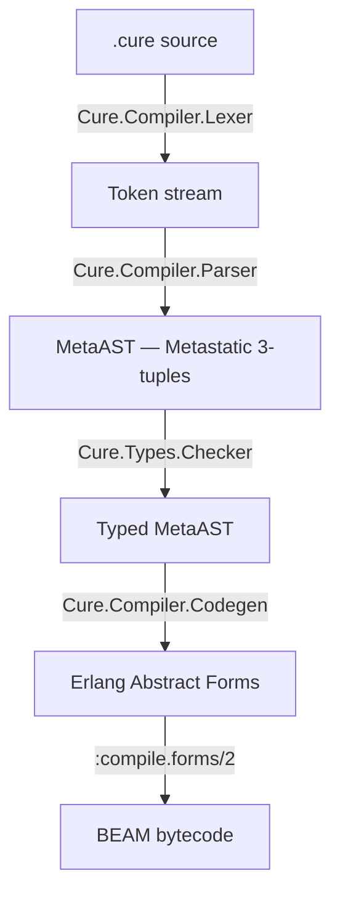

# Cure

Dependently-typed programming language for the BEAM virtual machine with
first-class finite state machines and SMT-backed verification.

Cure compiles `.cure` source files to BEAM bytecode, enabling programs to run
natively on the Erlang VM alongside Erlang and Elixir code.

## Status

Milestone 11 -- Pattern Exhaustiveness. All core milestones complete plus
a self-hosted standard library, ad-hoc polymorphism via `proto`/`impl`,
SMT-backed refinement type verification using Z3, and pattern exhaustiveness
checking. The full compilation pipeline is operational: lexer, parser,
bidirectional type checker with refinement types and exhaustiveness analysis,
protocol dispatch codegen, BEAM code generation, FSM compilation with
structural verification, stdlib, CLI, CI, and example programs.

## Architecture



Every pipeline stage emits structured events via `Cure.Pipeline.Events`,
backed by an Elixir `Registry` in PubSub mode. External tools (LSP, profilers,
IDE plugins) can subscribe to observe and react to compilation in real time.

## Internal Representation

Cure uses [Metastatic](https://hexdocs.pm/metastatic)'s MetaAST 3-tuple
format as its internal AST:

```elixir
{type_atom, keyword_meta, children_or_value}
```

This provides a well-defined, layered AST structure and interoperability with
Metastatic's cross-language analysis tools.

## Key Features

- **Dependent types** -- types that depend on values, verified at compile time
- **Refinement types** -- constrained subtypes checked via SMT solver
- **First-class FSMs** -- finite state machines as language constructs with
  compile-time verification (reachability, deadlock freedom, guard exhaustiveness)
- **Indentation-structured** -- no closing delimiters, visual layout determines scope
- **Expression-oriented** -- everything is an expression, the last expression in a block is its value
- **BEAM-native** -- compiles to standard BEAM bytecode, full OTP interoperability
- **Protocols** -- ad-hoc polymorphism via `proto`/`impl` with
  guard-based dispatch compiled to multi-clause BEAM functions

## Quick Example

```cure
mod MyApp.Math
  use Std.{Result, Option}

  type Sign = Positive | Negative | Zero

  fn factorial(n: Nat) -> Nat
    | 0 -> 1
    | n -> n * factorial(n - 1)

  fn classify(x: Int) -> Sign
    | x when x > 0 -> Positive
    | x when x < 0 -> Negative
    | _             -> Zero

  fn safe_divide(a: Int, b: {x: Int | x != 0}) -> Int = a / b
```

## Usage

```bash
# Compile a Cure source file to BEAM bytecode
mix cure.compile path/to/file.cure

# Compile all .cure files in a directory
mix cure.compile path/to/dir/ --output-dir _build/cure/ebin
```

From Elixir code:

```elixir
# Compile and load into the running VM
{:ok, module} = Cure.Compiler.compile_and_load(source)
module.my_function(args)

# Compile with type checking enabled
{:ok, module} = Cure.Compiler.compile_and_load(source, check_types: true)

# Compile to disk
{:ok, module, warnings} = Cure.Compiler.compile_file("hello.cure")
```

## Modules

- `Cure` -- root module, version
- `Cure.Pipeline.Events` -- PubSub event system (Registry-backed); every
  pipeline stage emits structured events that external tools can subscribe to
- `Cure.Compiler` -- orchestrator: source -> lex -> parse -> [check] -> codegen -> .beam
- `Cure.Compiler.Token` -- token struct (`type`, `value`, `line`, `col`)
- `Cure.Compiler.Lexer` -- tokenizer for the full Cure syntax (keywords,
  operators, literals, indentation, string interpolation, FSM transitions)
- `Cure.Compiler.Parser` -- Pratt (precedence-climbing) parser producing
  MetaAST 3-tuples; indentation-aware, handles all expression and structural
  forms (functions, modules, records, types, protocols, implementations,
  imports, FSMs)
- `Cure.Compiler.Parser.Precedence` -- operator binding power table
- `Cure.Compiler.Codegen` -- MetaAST to Erlang abstract forms; compiles
  expressions, patterns, module assembly, `@extern` FFI wrappers, multi-clause
  functions, ADT constructors (tagged tuples), records (maps)
- `Cure.Compiler.BeamWriter` -- compiles Erlang abstract forms to BEAM
  bytecode via `:compile.forms/2` and writes `.beam` files
- `Cure.Types.Type` -- canonical type representations (primitives, composites,
  ADTs, records, function types); subtyping, join, type-expression resolution
- `Cure.Types.Env` -- scoped typing environment with built-in types and
  operator signatures; variable and type bindings
- `Cure.Types.Checker` -- bidirectional type checker; validates literals,
  variables, operators, function definitions, calls, let bindings, conditionals,
  pattern matching, blocks, collections, lambdas, modules (two-pass); emits
  `:type_checker` pipeline events
- `Cure.FSM.Verifier` -- structural FSM verification: reachability (BFS),
  deadlock freedom, terminal state validation; emits `:fsm_verifier` events
- `Cure.FSM.Compiler` -- FSM MetaAST to `gen_statem` BEAM modules (`mod TrafficLight`
  compiles to `:'Cure.FSM.TrafficLight'`); generates `start_link`, `send_event`,
  `get_state`, transition handling with wildcard support
- `Cure.Compiler.Errors` -- structured error formatter with source locations
  for all pipeline stages (lex, parse, type, codegen, FSM verifier)
- `Cure.Types.Protocol` -- protocol definition and implementation tracking;
  type-to-guard mapping, dispatch clause generation
- `Cure.Types.Refinement` -- refinement type operations; SMT-backed subtype
  checking, satisfiability verification, construction from parser AST
- `Cure.SMT.Process` -- Z3 solver process management via Erlang port;
  interactive query execution with timeout and sentinel-based response parsing
- `Cure.SMT.Translator` -- MetaAST to SMT-LIB2 translation; operator mapping,
  variable collection, logic inference, query generation
- `Cure.SMT.Solver` -- high-level constraint API; satisfiability checking,
  implication proving, refinement subtype verification; Z3 fallback
- `Cure.Types.PatternChecker` -- pattern exhaustiveness and redundancy analysis;
  coverage checking for Bool, Result/Option ADTs, List, infinite types;
  integrated into type checker as warnings
- `Mix.Tasks.Cure.Compile` -- `mix cure.compile` task with formatted error output
- `Mix.Tasks.Cure.CompileStdlib` -- `mix cure.compile_stdlib` compiles the standard library

## Standard Library

The standard library is self-hosted -- written in Cure itself under `lib/std/`.
Compile it with `mix cure.compile_stdlib`.

- **`Std.Core`** (36 functions) -- identity, compose, pipe, boolean ops,
  comparisons, Result type (ok, error, is_ok, map_ok, and_then, or_else),
  Option type (some, none, is_some, unwrap, map_option, flat_map_option)
- **`Std.List`** (25 functions) -- length, head, tail, last, cons, append,
  concat, reverse, map, filter, foldl, foldr, flat_map, zip_with, nth, take,
  drop, contains, find, any, all, sum, product, count
- **`Std.Math`** (18 functions) -- abs, sqrt, pow, log, log2, log10, ceil,
  floor, round, pi, max, min, clamp, sign, negate, is_even, is_odd, safe_div
- **`Std.String`** (17 functions) -- length, is_empty, concat, downcase, upcase,
  trim, from_int, from_float, from_atom, to_int, to_float, to_atom, split,
  repeat, reverse
- **`Std.Pair`** (9 functions) -- element, first, second, swap, map_first,
  map_second, map_both, to_list, from_list
- **`Std.Show`** (6 functions) -- Show protocol with `show/1` dispatch for
  Int, Float, String, Bool, Atom; `show_line/1` convenience
- **`Std.Io`** (8 functions) -- put_chars, println, print, int_to_string,
  float_to_string, atom_to_string, print_int, print_float
- **`Std.System`** (10 functions) -- monotonic_time, system_time, timestamp_ms,
  timestamp_us, self, node, system_info, otp_version, cpu_count, exit

## Examples

See the `examples/` directory for sample Cure programs:

- `hello.cure` -- minimal module with a greeting function
- `math.cure` -- arithmetic, multi-clause factorial, conditionals
- `traffic_light.cure` -- FSM definition with wildcard transitions
- `list_basics.cure` -- list operations (map, filter, fold)
- `result_handling.cure` -- Result type error handling with and_then
- `pattern_guards.cure` -- pattern matching, guards, match expressions
- `recursion.cure` -- recursive functions (factorial, fibonacci, reverse)
- `protocols.cure` -- protocol definition and dispatch
- `ffi.cure` -- calling Erlang functions via @extern
- `adt.cure` -- algebraic data types (Option, Result, Color)

Compile and run:

```bash
cure compile examples/hello.cure
cure run examples/recursion.cure
cure check examples/protocols.cure
```

## Documentation

- [Language Specification](docs/LANGUAGE_SPEC.md) -- syntax, keywords, operators, all constructs
- [Type System](docs/TYPE_SYSTEM.md) -- bidirectional checking, refinement types, SMT verification
- [FSM Guide](docs/FSM_GUIDE.md) -- FSM definition, compilation, runtime, verification
- [Standard Library](docs/STDLIB.md) -- API reference for all 9 stdlib modules

## Building

```bash
mix deps.get
mix compile
mix test
```

## Quality

```bash
mix format
mix credo --strict
mix dialyzer
```

## License

To be determined.
