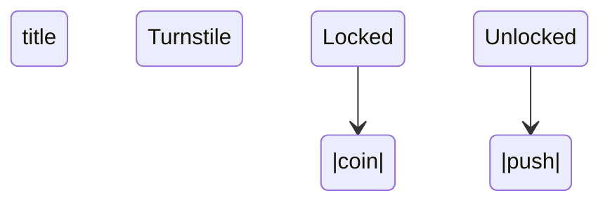

%{
  title: "Cure v0.32.0 :: Trust, Export, Recall, Narrate",
  author: "Aleksei Matiushkin",
  description: "v0.32.0 closes four distinct gaps that have been on the backlog since the registry landed in v0.23.0. Proof-carrying packages let consumers re-verify a publisher's type obligations offline, without re-running Z3. `cure export-types` translates Cure record and ADT declarations directly to proto3. `cure snap` saves and restores the entire REPL environment as a binary file. `cure story` reads a project and writes a narrative STORY.md introducing the system top-down: apps, supervisors, actors, FSMs, types.",
  tags: ~w(release trust packages protobuf repl story)
}
---

`v0.31.0` was about efficiency -- paying less for polymorphism,
steering the optimiser with evidence. `v0.32.0` is about trust,
reach, memory, and legibility. Four features, four independent
corners of the language, four things that should have shipped earlier
and finally did.

## The problem with trust

The Cure package registry (v0.23.0) signs tarballs, verifies them
against a transparency log, and checks Ed25519 signatures against
locally trusted public keys. That is the supply-chain story. But it
says nothing about what the package *claims to do*: a published
library carries a proof that its refinement predicates hold, its
equality laws are reflexive, its totality arguments are structurally
decreasing. Those proofs live inside the compiler at publish time and
are silently discarded afterwards.

`v0.32.0` stops discarding them.

## Proof-carrying packages

When `cure publish` assembles a tarball, the compiler is re-invoked
in `proof_collect` mode. Every proof obligation the type-checker
discharges -- an `Eq(T, a, b)` witness, a refinement predicate, an
SMT constraint, a structural-decrease argument -- is serialised as a
certificate and written into a compact binary file that rides along
with the source:

```
my_pkg-0.1.0/
  Cure.toml
  lib/*.cure
  my_pkg.cureproof     <-- new in v0.32.0
```

The format is a fixed magic header followed by a gzip-compressed
Erlang term:

```
"CUREPROOF\0" <> <<0x01>> <> gzip(term_to_binary([cert, ...]))
```

Each certificate is a plain map:
`%{module: "Foo.Bar", kind: :equality | :refinement | :smt | :totality, statement: term(), witness: term()}`.

`cure verify` reads `.cureproof` artifacts from a tarball or an
installed dep directory and replays each certificate through the
offline verifier -- no source required, no full compiler invocation,
no Z3 for equality and refinement proofs:

```bash
# verify the current project's own proofs
mix cure.verify

# verify a downloaded tarball before trusting it
mix cure.verify my_pkg-0.1.0.tar.gz

# strict mode: treat a missing artifact as an error
mix cure.verify --strict _build/cure/deps/my_pkg-0.1.0/
```

The CI story is two lines:

```bash
mix cure.verify --strict _build/cure/deps/
```

Proof collection is on by default. Opt out per project:

```toml
[publish]
include_proofs = false
```

Three new error codes: **E065 Proof File Missing**, **E066 Proof
Verification Failed**, **E067 Proof Schema Incompatible**.

The full reference lives in
[`docs/PROOF_CARRYING.md`](https://github.com/am-kantox/cure-lang/blob/main/docs/PROOF_CARRYING.md).

## Cross-language ADT export

A Cure system rarely lives alone. It publishes events that Python
consumers decode, accepts HTTP payloads that Go services shape, stores
records that Rust clients de-serialise. Everyone hand-writes a schema.
Everyone forgets to update it. v0.32.0 generates it.

`cure export-types` parses a `.cure` file -- or an entire project --
and emits a schema file per source. The first target is proto3:

```bash
mix cure.export_types --target protobuf
# writes to _build/cure/export/protobuf/

mix cure.export_types --target protobuf lib/events.cure --out proto/
mix cure.export_types --dry-run   # print without writing
```

The mapping table covers everything that has a natural proto3
equivalent:

```
Int           -> int64
Float         -> double
Bool          -> bool
String        -> string
Bytes         -> bytes
List(T)       -> repeated T
Option(T)     -> optional T
rec Foo {...} -> message Foo { ... }
```

Pure-enum ADTs (no payload) map to proto3 `enum`:

```cure
type Status = Active | Inactive | Archived
```

```proto3
enum Status {
  STATUS_UNSPECIFIED = 0;
  ACTIVE = 1;
  INACTIVE = 2;
  ARCHIVED = 3;
}
```

Payload-bearing ADTs become wrapper messages with a `oneof value`
block plus one synthetic payload message per variant:

```cure
type Shape = Circle(Int) | Rectangle(Int, Int) | Point
```

```proto3
message Shape {
  oneof value {
    ShapeCirclePayload circle = 1;
    ShapeRectanglePayload rectangle = 2;
    bool point = 3;
  }
}
message ShapeCirclePayload { int64 value = 1; }
message ShapeRectanglePayload { int64 field1 = 1; int64 field2 = 2; }
```

Types that have no proto3 equivalent -- refinements, dependent
indices, higher-kinded shapes -- emit a `bytes` field with a comment
and raise **E068 Export Type Unmappable** as a warning (not a hard
error; partial exports remain useful).

The full reference is in
[`docs/EXPORT_TYPES.md`](https://github.com/am-kantox/cure-lang/blob/main/docs/EXPORT_TYPES.md).

## cure snap: save and restore the REPL environment

The REPL has always been a great place to explore a problem. It has
been a poor place to remember that you did. Session history is a
transcript; it tells you what you typed, not what survived. The
definitions you accumulate over an afternoon -- the helper function,
the proof-checking type alias, the length-indexed test fixture -- live
only in the running process. Close it and they are gone.

`cure snap` gives you a freeze-and-thaw button:

```
cure(7)> :snap save my-session.cure-snap
session saved to my-session.cure-snap

# later, in a new REPL
cure(1)> :snap load my-session.cure-snap
loaded snap from my-session.cure-snap (12 definition(s) merged)
```

The `.cure-snap` file is a compact binary:

```
"CURESNAP\0" <> <<0x01>> <> gzip(term_to_binary(snap_map))
```

It captures everything that defines a session's shape: every named
declaration (`fn`, `type`, `rec`, `proto`, `impl`, `proof`), up to
500 history entries, the `use` import list, open typed holes, the
stdlib import mode, the theme, the editing mode, and an advisory list
of files loaded via `:load`. Loading a snap merges rather than
replaces: definitions merge with last-writer-wins semantics, history
is prepended, imports are unioned. The session you load *into*
survives intact and gains the snap's definitions on top.

The full suite of meta-commands:

```
:snap save [path]    -- save to path (default: cure.snap)
:snap load <path>    -- load and merge from path
:snap list [dir]     -- list .cure-snap files in dir (default: .)
```

The Mix task adds an inspection surface without needing a running
REPL:

```bash
mix cure.snap load my-session.cure-snap
# Snap file: my-session.cure-snap
# Schema version: 0.1
# Definitions: 12
# Imports: 3
# History entries: 47
```

Two new error codes: **E069 Snap Schema Incompatible**,
**E070 Snap Module Missing** (emitted as a warning when a `:load`-ed
path from the saved session no longer exists on disk; the rest of the
session restores normally).

Full reference at
[`docs/SNAP.md`](https://github.com/am-kantox/cure-lang/blob/main/docs/SNAP.md).

## cure story: the system explains itself

Every project reaches a moment where a newcomer reads the source tree
and has no idea where to start. The supervisor is named `Root` but
roots nothing the reader has heard of; the actor is named `Worker` but
works on things nobody documented; the FSM is named `Auth` but auth
what? The system knows all of this. Nobody asked it to say.

`cure story` asks:

```bash
mix cure.story
# writes STORY.md in the project root

mix cure.story --diagrams
# embeds Mermaid stateDiagram-v2 for every FSM

mix cure.story --out docs/ARCHITECTURE.md --format html
# HTML shell for standalone viewing

mix cure.story --stdout
# prints to stdout, nothing written to disk
```

The generator parses every `.cure` file under `lib/`, classifies each
AST container into a five-layer outline -- apps, supervisors, actors,
FSMs, shared types -- and emits structured prose for each level:

```markdown
## Applications

### `Demo`

The `Demo` application is the root of the system. It starts
supervisor(s): `Demo.Root`.

## Supervisors

### `Demo.Root`

The `Demo.Root` supervisor applies a `one-for-one` restart strategy.
It manages: `Demo.Worker` and `Demo.Logger`.

## FSMs

### `Turnstile`

The `Turnstile` FSM models 2 state(s): `Locked`, `Unlocked`.
3 transition(s) are defined.
```

With `--diagrams`, each FSM section gains a Mermaid code block that
renders in GitHub Markdown, GitLab, and any Mermaid-aware viewer
without any extra tooling:



`STORY.md` is generated from source, so it stays accurate. A
CI step that regenerates it and diffs against the committed version
turns architecture drift into a failing check before it becomes a
support burden:

```bash
mix cure.story --out /tmp/STORY.md
diff STORY.md /tmp/STORY.md || exit 1
```

Full reference at
[`docs/STORY.md`](https://github.com/am-kantox/cure-lang/blob/main/docs/STORY.md).

## Numbers

New modules shipped: `Cure.Project.Proof`, `Cure.Project.Proof.Verifier`,
`Cure.ExportTypes`, `Cure.ExportTypes.Protobuf`, `Cure.REPL.Snap`,
`Cure.Story`, `Cure.Story.Outline`, `Cure.Story.Narrator`. Surgical
extensions to `Cure.Compiler`, `Cure.Project`, `Cure.Project.Publisher`,
`Cure.REPL`, and `Cure.CLI`.

Six new error codes: **E065**--**E070**.

Four new docs:
[`docs/PROOF_CARRYING.md`](https://github.com/am-kantox/cure-lang/blob/main/docs/PROOF_CARRYING.md),
[`docs/EXPORT_TYPES.md`](https://github.com/am-kantox/cure-lang/blob/main/docs/EXPORT_TYPES.md),
[`docs/SNAP.md`](https://github.com/am-kantox/cure-lang/blob/main/docs/SNAP.md),
[`docs/STORY.md`](https://github.com/am-kantox/cure-lang/blob/main/docs/STORY.md).
All four wired into the Hex documentation extras.

The four new Mix tasks: `mix cure.verify`, `mix cure.export_types`,
`mix cure.snap`, `mix cure.story`. All four wired into the standalone
`cure` escript.

**Zero credo issues** across 287 source files in strict mode.

## What's next

The three items deferred from v0.31.0 remain in order, with one new
entrant pushing to the top.

- **Cure-native notebook** -- a first-class `.cnb` format evaluated
  by a Livebook-style runner. Syntax-highlighted via `makeup_cure`,
  inline Mermaid FSM diagrams, live type hints. The groundwork is
  already in place: `Cure.Doc.Mermaid` for diagrams,
  `Cure.Doc.HtmlGenerator` for rendering, the `Cure.REPL` evaluation
  pipeline for live code cells.
- **Typed hot code upgrades** -- `cure release --upgrade-from`,
  SMT-verified `@migration` functions, E057/E058. The appup/relup
  machinery deserves its own cycle and continues to get one.
- **Automatic PGO instrumentation** -- inject
  `Cure.PGO.Recorder.tick/1` at every compiled function's entry so
  `cure run --record-profile` produces useful profiles by default
  without manual instrumentation.
- **`cure export-types --target typescript`** and
  `--target rust` -- the Protobuf backend proved the extractor API;
  TypeScript and Rust emitters are a matter of adding backend modules
  without touching the AST walker.

The repository lives at
[github.com/am-kantox/cure-lang](https://github.com/am-kantox/cure-lang).
The full
[CHANGELOG](https://github.com/am-kantox/cure-lang/blob/main/CHANGELOG.md#0320----trust-export-recall-narrate)
lists every touch point.
